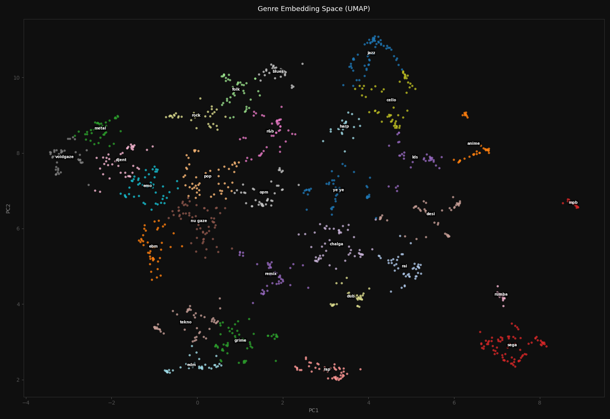
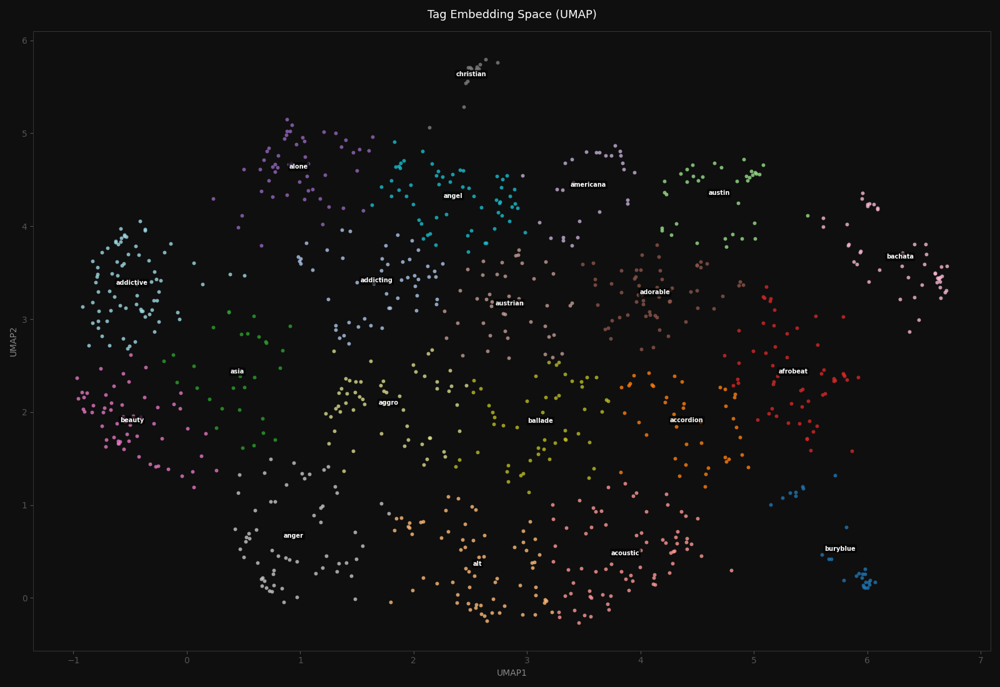
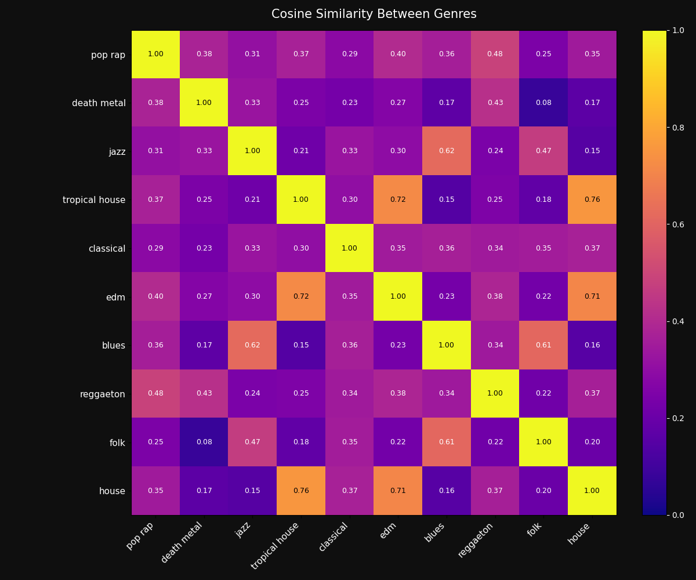
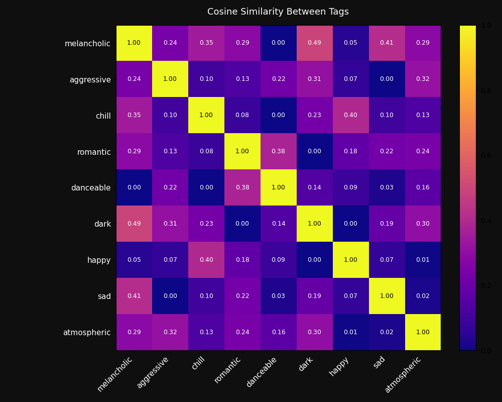
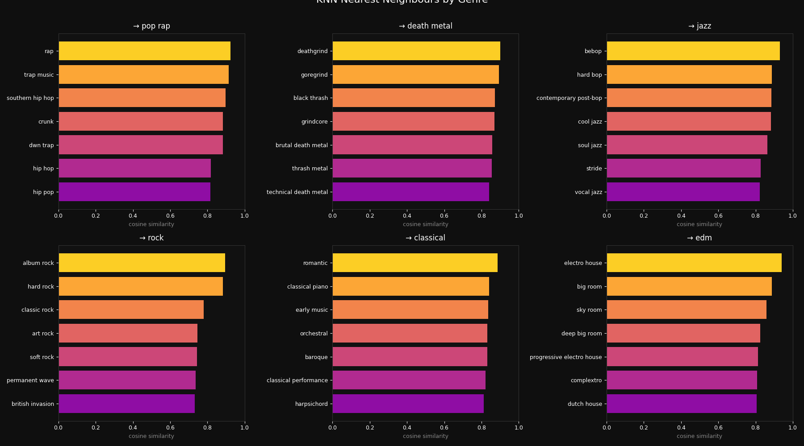
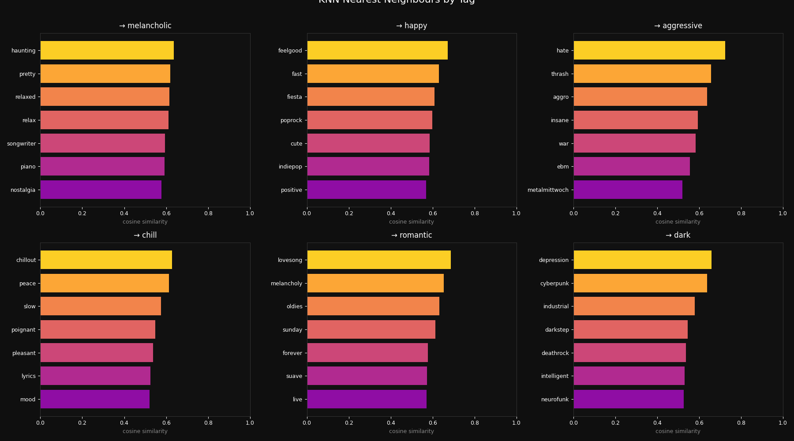
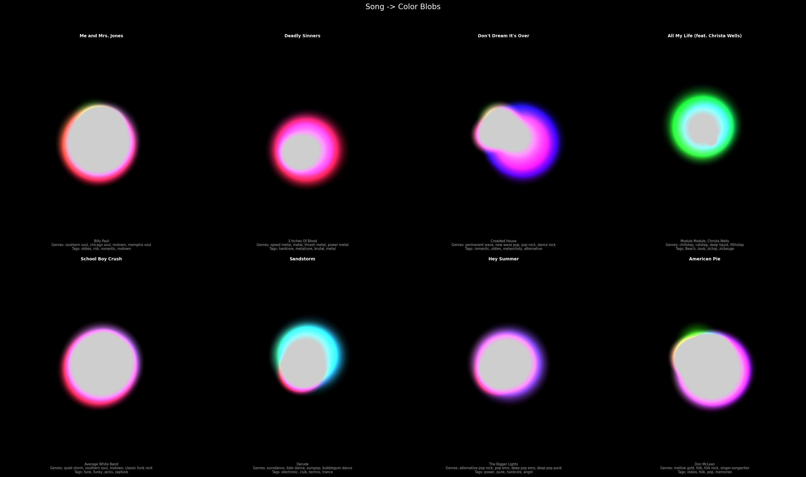
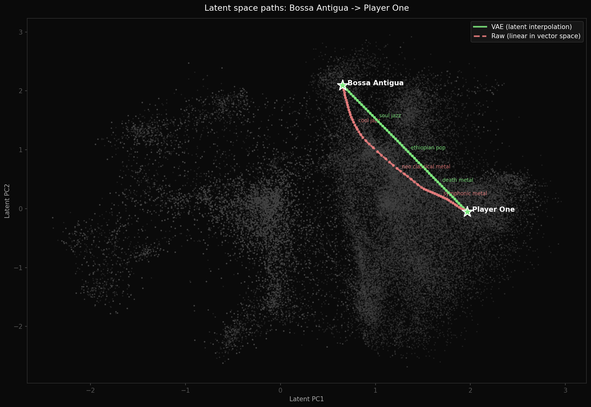
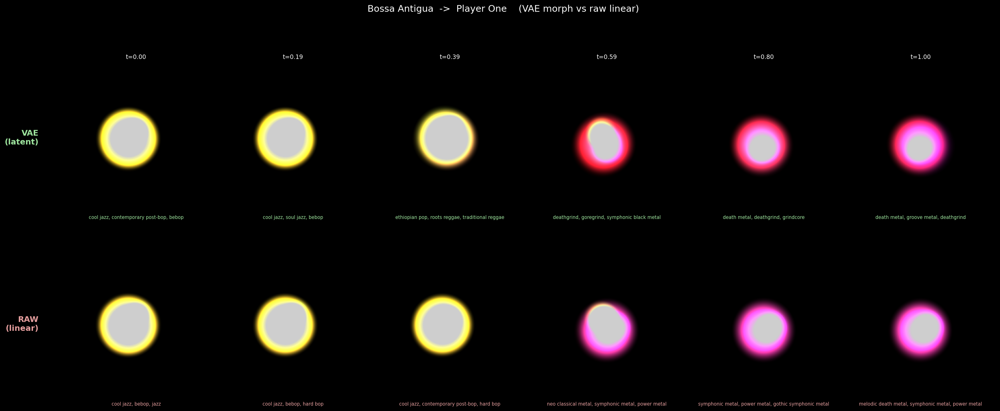
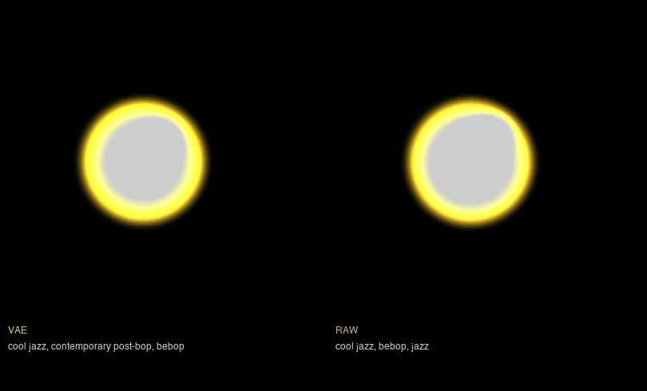

# Song2Vec
A deep learning project that converts song embeddings into colored images, depending on the genres and tags of the song. 
With both embedding spaces we also trained a VAE model to compute the most optimal path between two songs.

# Getting Data

Go to the `data_scraping` dir and download `data.zip` and extract `songs.csv` and `tags.csv` into `./data/csv`

# Results

Results of our genre and tag embeddings:

### UMAP plots

### Cosine Similarity

### Nearest Neighbors check

# Visualizations

We made visualizations for these embeddings and tags together for songs. Here are some of them:

### VAE vs Linear comparison

